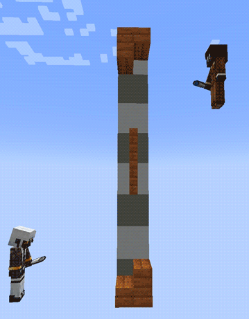

# Simple Water Gravity

Gives water (and Lava) sources a sand-like gravity, making it more intuitive to work with deep bodies of water.

Water sources will fall straight down, until they are supported by a solid block, or by another source. They will also fall through the open sides of water-loggable blocks.

This should theoretically work with other modded fluids.

